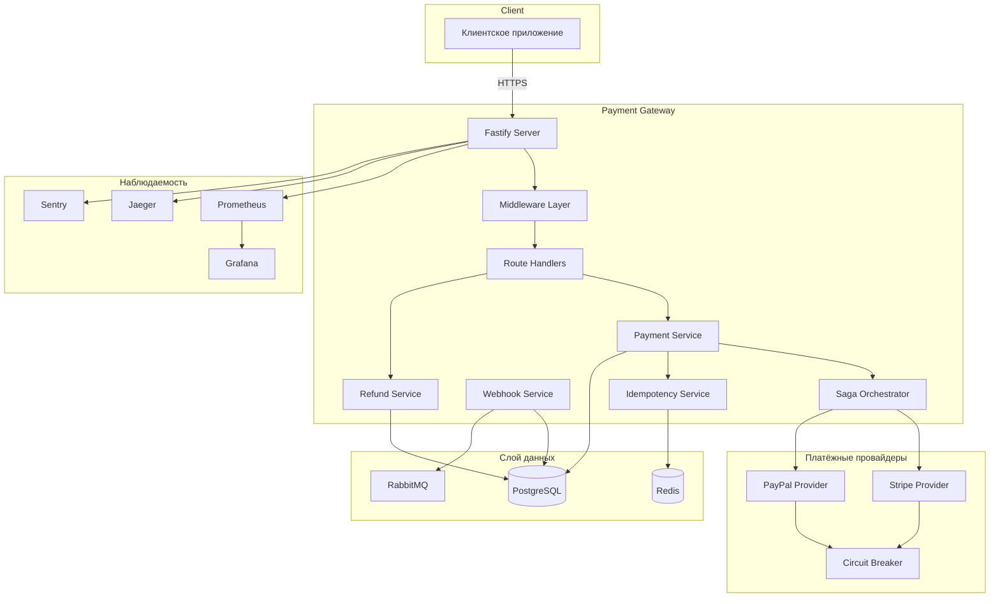
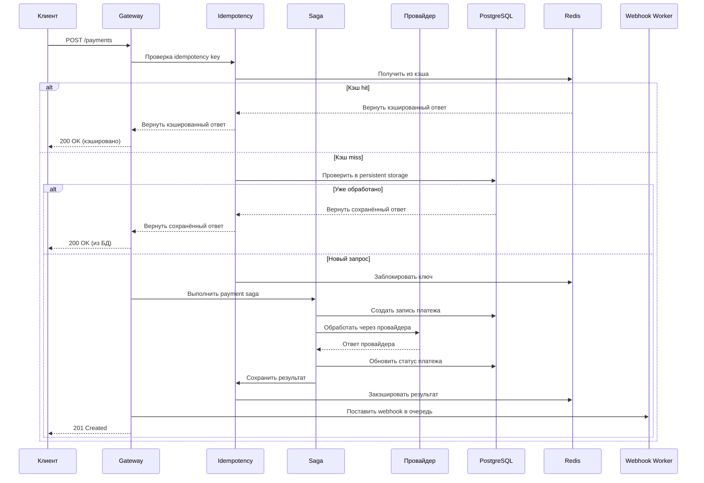
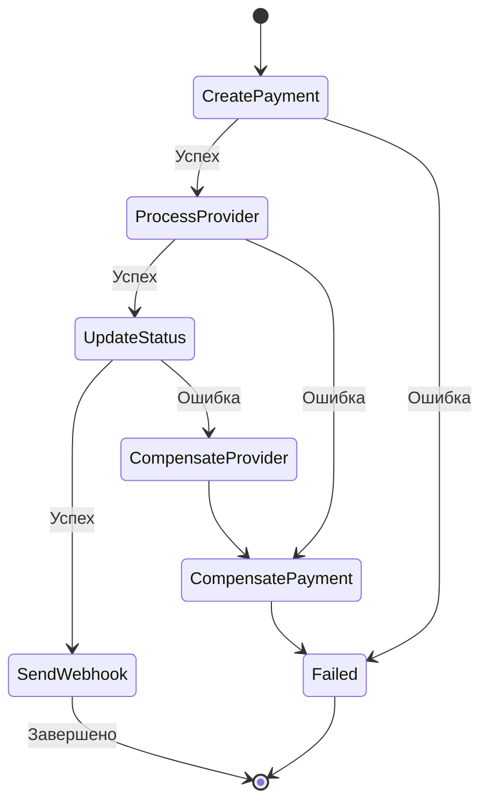
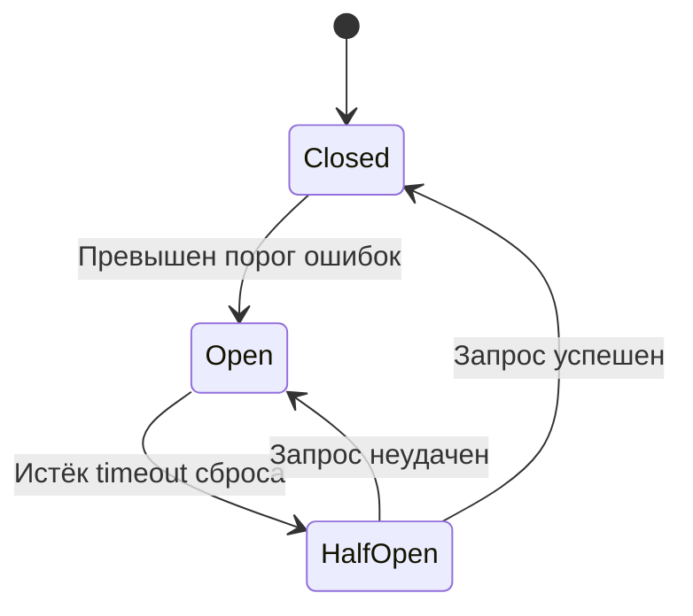
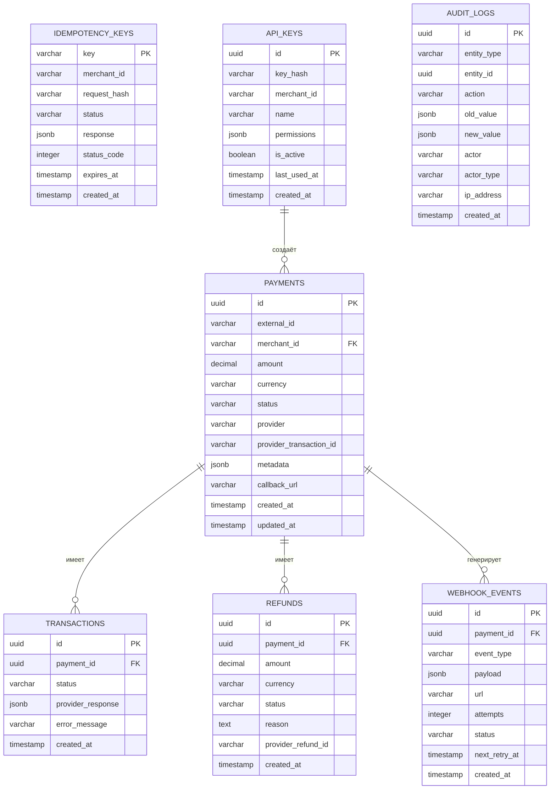
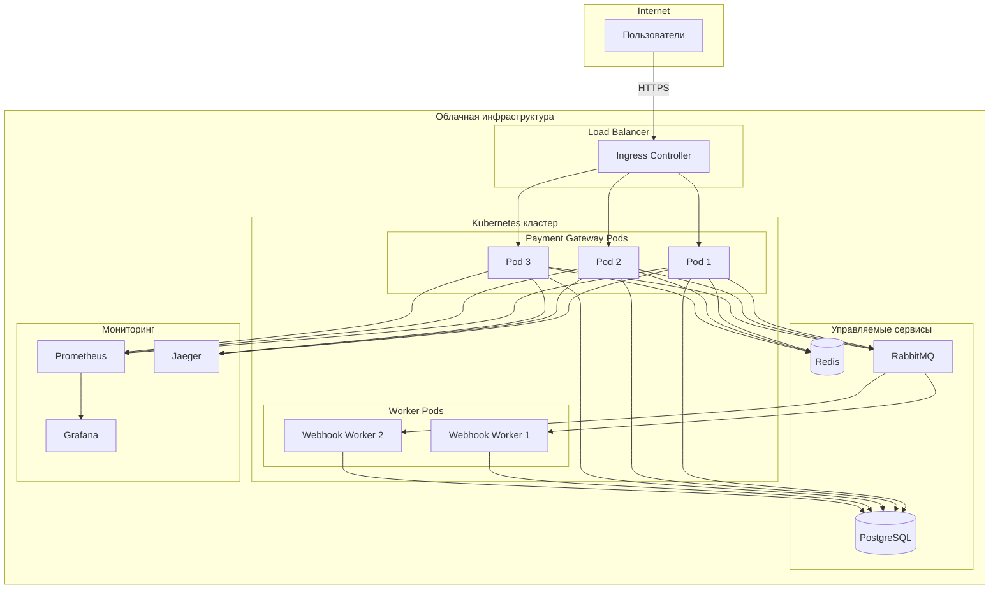
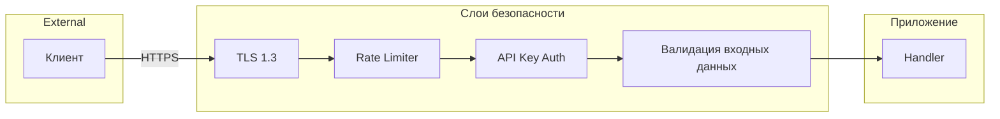

# Обзор архитектуры

## Системная архитектура

## Поток запроса

## Saga паттерн

## Состояния Circuit Breaker

## Модель данных

## Архитектура деплоя

## Слои безопасности

## Технологический стек

| Слой | Технология |
|------|------------|
| Runtime | Node.js 20 |
| Фреймворк | Fastify 4.x |
| Язык | TypeScript 5.x |
| База данных | PostgreSQL 16 |
| Кэш | Redis 7 |
| Очередь сообщений | RabbitMQ 3 |
| Метрики | Prometheus |
| Дашборды | Grafana |
| Трассировка | OpenTelemetry + Jaeger |
| Ошибки | Sentry |
| Контейнеризация | Docker |
| Оркестрация | Kubernetes |
